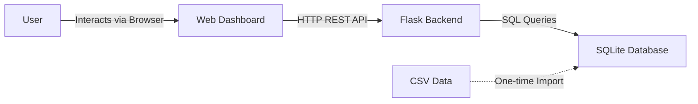
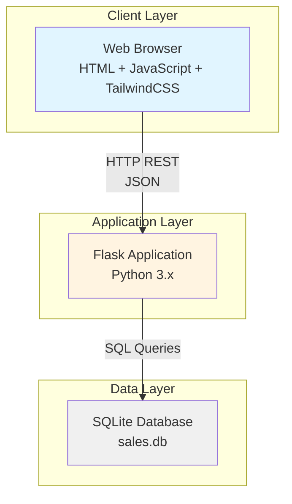
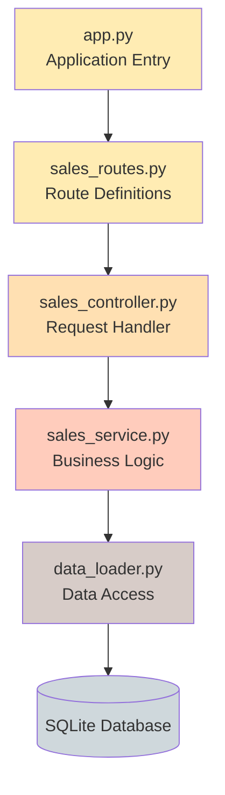
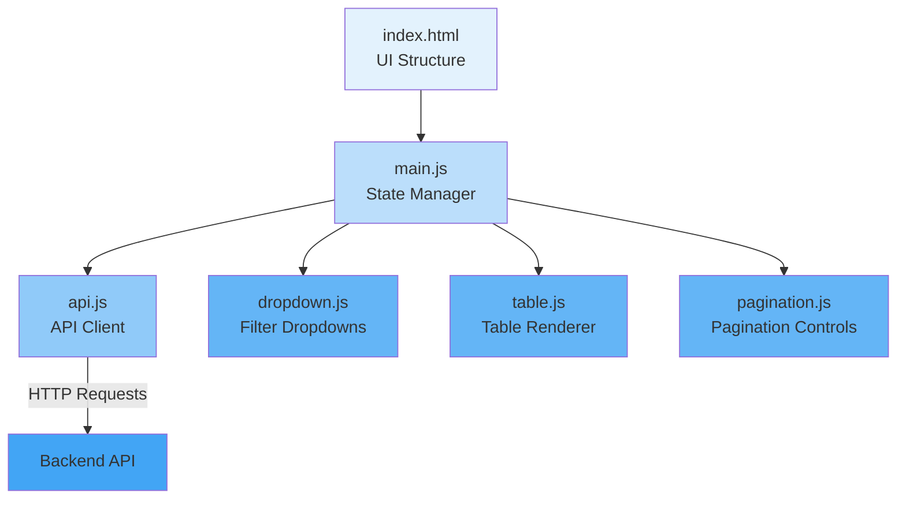
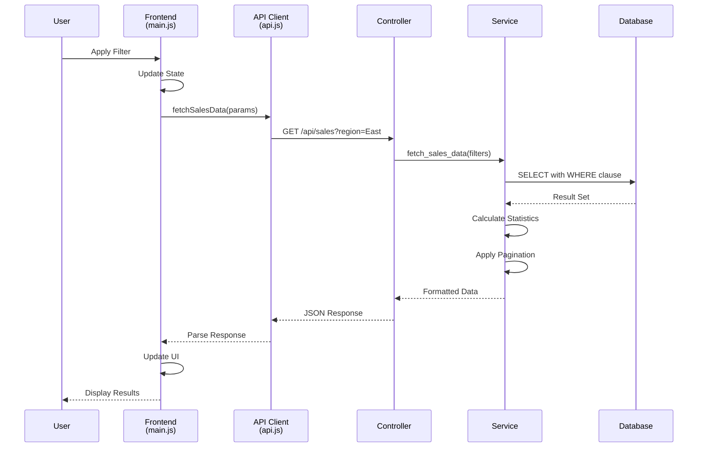
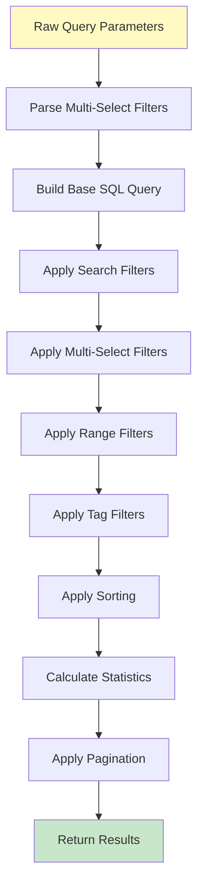
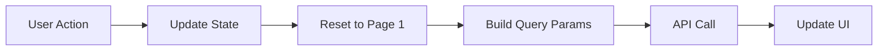
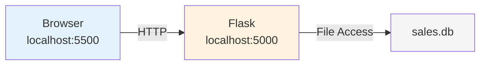
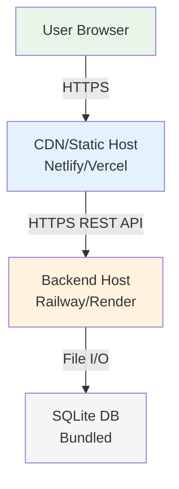

# System Architecture – Retail Sales Management System

## 1. Overview

This document describes the architecture of the Retail Sales Management System, a full-stack web application for exploring and analyzing retail sales data. The system provides filtering, sorting, search, and pagination capabilities over a large dataset (1M+ records).

**Technology Stack:**
- Backend: Python Flask + SQLite
- Frontend: HTML, Vanilla JavaScript (ES6), TailwindCSS
- API: RESTful JSON API
- Data: CSV converted to SQLite database

## 2. System Context



**Actors:**
- End Users: View and analyze sales data through web interface
- System Administrator: Deploy and maintain the application

**External Dependencies:**
- TailwindCSS CDN (styling)
- Modern web browser with ES6 support

## 3. Architecture Style

**Pattern:** Layered Architecture with Client-Server Model

**Rationale:**
- Clear separation of concerns (presentation, business logic, data)
- Independent frontend and backend development
- Easy to test individual layers
- Simple deployment model suitable for assignment scope

## 4. Container Architecture



### Container Descriptions

**Web Browser (Frontend Container)**
- Technology: HTML5, JavaScript ES6, TailwindCSS
- Responsibility: User interface, state management, API consumption
- Deployment: Static hosting (Live Server, Netlify, Vercel)

**Flask Application (Backend Container)**
- Technology: Python Flask, Flask-CORS
- Responsibility: Business logic, filtering, sorting, pagination, API endpoints
- Deployment: Python web server (development: Flask built-in, production: Gunicorn)

**SQLite Database (Data Container)**
- Technology: SQLite 3
- Responsibility: Persistent data storage, query execution
- Deployment: File-based database bundled with application

## 5. Component Architecture

### Backend Components



**Component Responsibilities:**

| Component | File | Responsibility |
|-----------|------|----------------|
| Application Factory | `app.py` | Flask initialization, CORS setup, blueprint registration |
| Routes | `sales_routes.py` | URL mapping to controllers |
| Controller | `sales_controller.py` | HTTP request/response handling, parameter extraction |
| Service | `sales_service.py` | Filtering logic, sorting, pagination, statistics |
| Data Access | `data_loader.py` | Database connections, metadata caching |

### Frontend Components



**Component Responsibilities:**

| Component | File | Responsibility |
|-----------|------|----------------|
| HTML Layout | `index.html` | Page structure, filter controls, table container |
| State Manager | `main.js` | Application state, event coordination, data loading |
| API Client | `api.js` | Backend communication, request construction |
| Dropdown Component | `dropdown.js` | Multi-select filter UI logic |
| Table Renderer | `table.js` | Data display, formatting, statistics |
| Pagination | `pagination.js` | Page navigation UI |

## 6. Data Flow

### Request-Response Flow



### Data Processing Pipeline


## 7. Key Design Decisions

### Decision 1: SQLite vs PostgreSQL

**Choice:** SQLite

**Rationale:**
- Assignment scope: read-heavy, single-user dashboard
- Zero configuration required
- Portable database file
- Sufficient performance for 1M records with pagination
- Eliminates need for separate database server setup

**Trade-offs:**
- Limited concurrent write support (not needed for this use case)
- No advanced features like full-text search indexes
- File-based locking (acceptable for assignment)

**Migration Path:** Switch to PostgreSQL if multi-user or write-heavy operations needed

---

### Decision 2: Server-side vs Client-side Filtering

**Choice:** Server-side filtering

**Rationale:**
- Dataset too large (1M+ records) for client-side processing
- Reduces network bandwidth (only 10 records per request)
- Better performance and scalability
- Allows complex SQL-based filtering

**Trade-offs:**
- Requires API call for every filter change
- Slight latency vs instant client-side filtering
- More complex backend logic

---

### Decision 3: Vanilla JavaScript vs React/Vue

**Choice:** Vanilla JavaScript with ES6 modules

**Rationale:**
- No build process required
- Faster development for simple UI
- Demonstrates understanding of fundamental JavaScript
- Lightweight (no framework overhead)
- Acceptable for assignment complexity

**Trade-offs:**
- Manual DOM manipulation
- More verbose code for state management
- No component lifecycle management
- Would not scale for complex UIs

---

### Decision 4: REST API vs GraphQL

**Choice:** REST API

**Rationale:**
- Simple resource-based operations (read sales data)
- Standard HTTP methods sufficient
- Easy to test and document
- No need for complex query capabilities

**Trade-offs:**
- Fixed response structure (no field selection)
- Multiple endpoints vs single GraphQL endpoint
- Potential over-fetching of data

## 8. API Design

### Endpoint: GET /api/sales

**Purpose:** Retrieve filtered, sorted, paginated sales data

**Query Parameters:**

| Category | Parameters | Example |
|----------|-----------|---------|
| Search | `search_name`, `search_phone` | `search_name=John` |
| Filters | `customer_region`, `gender`, `product_category`, `tags`, `payment_method` | `customer_region=East,North` |
| Ranges | `age_min`, `age_max`, `date_from`, `date_to` | `age_min=20&age_max=40` |
| Sorting | `sort_by`, `sort_order` | `sort_by=date&sort_order=desc` |
| Pagination | `page`, `page_size` | `page=1&page_size=10` |

**Response Structure:**
```json
{
  "items": [<array of sale records>],
  "page": 1,
  "page_size": 10,
  "total_items": 23822,
  "total_pages": 2383,
  "stats": {
    "total_quantity": 1948893,
    "total_amount": 56384555355.65,
    "total_discount": 1893939248.35
  }
}
```

### Endpoint: GET /api/filters

**Purpose:** Retrieve available filter options for dropdowns

**Response Structure:**
```json
{
  "customer_region": ["North", "South", "East", "West"],
  "gender": ["Male", "Female", "Other"],
  "product_category": ["Electronics", "Clothing", ...],
  "tags": ["Premium", "Organic", ...],
  "payment_method": ["Credit Card", "Cash", ...]
}
```

## 9. Filtering Implementation

### Filter Processing Sequence



### SQL Query Construction

**Base Query:**
```sql
SELECT * FROM sales WHERE 1=1
```

**Add Search Filters:**
```sql
AND LOWER(customer_name) LIKE '%john%'
AND LOWER(phone_number) LIKE '%123%'
```

**Add Multi-Select Filters:**
```sql
AND customer_region IN ('East', 'North')
AND gender IN ('Female')
```

**Add Range Filters:**
```sql
AND age >= 20 AND age <= 40
AND date >= '2023-01-01' AND date <= '2023-12-31'
```

**Add Tag Filters:**
```sql
AND tags LIKE '%organic%'
AND tags LIKE '%premium%'
```

**Add Sorting:**
```sql
ORDER BY date DESC
```

**Add Pagination:**
```sql
LIMIT 10 OFFSET 0
```

## 10. State Management

### Frontend State Structure

```javascript
appState = {
    // Search
    search_name: "",
    search_phone: "",
    
    // Multi-select filters
    customer_region: "",      // "East,North"
    gender: "",               // "Female"
    product_category: "",
    tags: "",
    payment_method: "",
    
    // Range filters
    age_min: "",
    age_max: "",
    date_from: "",
    date_to: "",
    
    // Sorting
    sort_by: "date",
    sort_order: "desc",
    
    // Pagination
    page: 1,
    page_size: 10
}
```

### State Update Flow



## 11. Database Schema

```sql
CREATE TABLE sales (
    transaction_id TEXT,
    customer_id TEXT,
    customer_name TEXT,
    phone_number TEXT,
    customer_email TEXT,
    customer_age INTEGER,
    customer_region TEXT,
    gender TEXT,
    category TEXT,
    tags TEXT,
    quantity INTEGER,
    unit_price REAL,
    total_amount REAL,
    discount REAL,
    payment_method TEXT,
    date TEXT
);
```

**Key Columns for Operations:**
- Filtering: `customer_region`, `gender`, `category`, `tags`, `payment_method`
- Search: `customer_name`, `phone_number`
- Sorting: `date`, `quantity`, `customer_name`
- Range: `customer_age`, `date`

## 12. Deployment Architecture

### Development Environment



**Configuration:**
- Frontend: VS Code Live Server (port 5500)
- Backend: Flask development server (port 5000)
- Database: Local SQLite file
- CORS: Enabled for all origins

### Production Environment



**Configuration:**
- Frontend: Static hosting (Netlify, Vercel, GitHub Pages)
- Backend: Platform-as-a-Service (Railway, Render, Heroku)
- Database: SQLite file bundled with backend
- CORS: Restricted to frontend domain

## 13. Error Handling

### Backend Error Handling

```python
try:
    # Execute query
    results = execute_sql(query, params)
except sqlite3.Error as e:
    return {"error": "Database error"}, 500
except ValueError as e:
    return {"error": "Invalid parameters"}, 400
```

### Frontend Error Handling

```javascript
try {
    const data = await fetchSalesData(params);
    renderTable(data.items);
} catch (error) {
    displayError("Failed to load data. Please try again.");
}
```

### Handled Error Cases

- Empty filter results → Show "No data found" message
- Invalid date formats → Ignored or default applied
- Out-of-range page numbers → Redirect to page 1
- Database connection failures → Display error message
- Malformed API responses → Show generic error

## 14. Performance Considerations

### Current Implementation

**Query Optimization:**
- Pagination limits result set to 10 records per request
- Statistics calculated on filtered dataset before pagination
- Single database connection per request

**Frontend Optimization:**
- Minimal DOM manipulation
- Event debouncing on search inputs (future enhancement)
- Components only re-render when data changes

**Caching:**
- Filter metadata cached in memory on backend startup

### Scalability Limits

| Aspect | Current Limit | Bottleneck |
|--------|--------------|------------|
| Dataset Size | ~5M records | SQLite file size, query performance |
| Concurrent Users | ~10 users | SQLite file locking |
| Query Response Time | <1s for filtered queries | No indexes on filter columns |
| Filter Combinations | Unlimited | Query complexity grows with filters |

### Future Optimizations

If scaling beyond assignment scope:
1. Add database indexes on frequently filtered columns
2. Migrate to PostgreSQL for concurrent access
3. Implement Redis caching for common queries
4. Add connection pooling
5. Implement query result pagination on frontend

## 15. Security Considerations

### SQL Injection Prevention

```python
# Parameterized queries used throughout
cursor.execute(
    "SELECT * FROM sales WHERE region = ?",
    (region,)
)
```

### Input Validation

```python
def validate_sort_column(sort_by):
    allowed = ['date', 'quantity', 'customer_name']
    return sort_by if sort_by in allowed else 'date'
```

### CORS Policy

Development: Open to all origins (for testing)
Production: Restrict to specific frontend domain

## 16. Testing Approach

### Manual Testing Coverage

**Filtering:**
- Single filter application
- Multiple filter combinations
- Multi-value filter selections
- Edge cases (empty selections, all selected)

**Sorting:**
- Each sort column (date, quantity, customer_name)
- Both directions (ascending, descending)
- Sort with filters applied

**Pagination:**
- First page, last page, middle pages
- Navigation via page numbers
- Previous/Next button behavior
- Invalid page numbers

**Search:**
- Partial name matching
- Phone number search
- Case-insensitive behavior
- Combined with filters

**Reset:**
- Clear all filters and search
- Return to default state
- Verify all UI elements reset

## 17. Project Structure Summary

```
project/
├── backend/
│   ├── src/
│   │   ├── controllers/      # HTTP request handlers
│   │   ├── routes/           # URL mappings
│   │   ├── services/         # Business logic
│   │   ├── utils/            # Database access
│   │   └── app.py            # Application entry
│   ├── database/
│   │   └── sales.db          # SQLite database
│   ├── data/
│   │   └── sales.csv         # Source data
│   └── scripts/
│       └── create_db.py      # DB creation script
│
├── frontend/
│   └── src/
│       ├── components/       # UI components
│       ├── services/         # API client
│       ├── index.html        # Main page
│       └── main.js           # State management
│
└── docs/
    └── architecture.md       # This document
```

## 18. Technology Justification Summary

| Technology | Reason for Selection |
|------------|---------------------|
| Flask | Lightweight, simple routing, suitable for REST API |
| SQLite | Zero configuration, portable, sufficient for assignment |
| Vanilla JS | No build process, demonstrates fundamentals, lightweight |
| TailwindCSS | Rapid UI development, utility-first, CDN available |
| REST API | Simple resource operations, standard HTTP methods |

## 19. Limitations and Constraints

### Constraints

1. **Assignment scope** - Focused on core functionality over production features
2. **Development time** - Prioritized working features over optimizations
3. **Deployment simplicity** - Chosen technologies for easy setup and testing
4. **Browser compatibility** - Requires modern browsers with ES6 support

## 20. Conclusion

This architecture provides a clean, maintainable solution for the retail sales management system assignment. The layered approach separates concerns effectively, the REST API design is straightforward, and the technology choices balance simplicity with functionality.

The system successfully handles:
- Large datasets (1M+ records) through pagination
- Complex filtering with multiple criteria
- Dynamic sorting and search
- Statistical aggregation
- Responsive user interface

